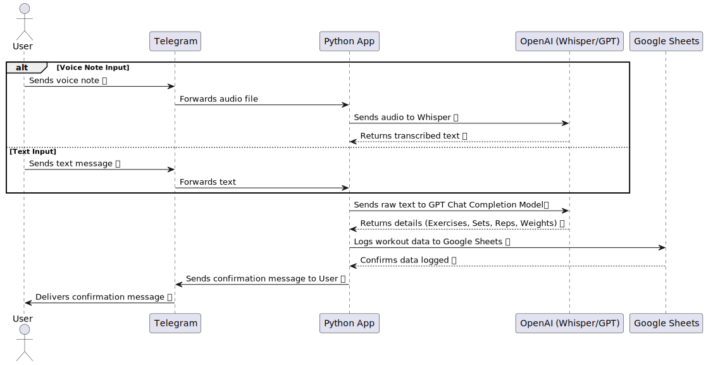
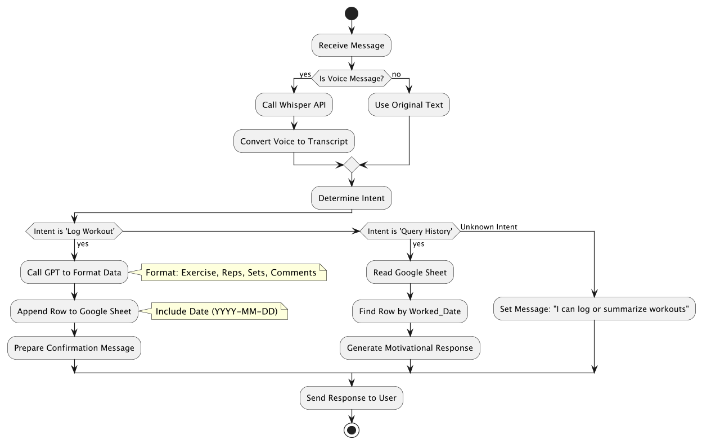

# Digital Gym Buddy

## Project Summary

This project involves building a Telegram bot that functions as an automated workout tracker. The bot will:

1. **Listen for messages** (voice or text) sent by users.
2. **Process the input** using OpenAI APIs:
   - **Whisper** for converting voice notes to text.
   - **GPT** for extracting structured workout data (e.g., exercise, weight, reps) from natural language.
3. **Log the data** into a Google Sheet for tracking workouts.
4. **Provide summaries** and calculate streaks by reading and analyzing the logged data.

## Key Tools Needed

* Python Libraries:**
  - `python-telegram-bot` or `aiogram` for handling Telegram messaging.
  - `openai` for integrating OpenAI APIs (Whisper and GPT).
  - `gspread` and `google-auth` for interacting with Google Sheets.

* **APIs:**
  - **Telegram Bot API** for receiving and sending messages.
  - **OpenAI API** for speech-to-text conversion (Whisper) and natural language processing (GPT).
  - **Google Sheets API** for reading and writing workout data.

* **Google Cloud Platform:**
  - Service account credentials for accessing Google Sheets.

## Sequence Diagram

## Class Diagram

## Activity Diagram
